# 電商客戶價值分析與預測報告

## 引言

本報告旨在透過機器學習模型，深度分析與預測電商平台客戶的生命週期價值。報告結合了「客戶流失預測」、「潛力長期客戶預測」與「客戶投訴行為預測」三大核心隨機森林模型，並利用 `TreeSHAP` 歸因技術解構各模型背後的業務驅動特徵，以協助營運與客服團隊精準掌握流失臨界點與忠誠度分水嶺，進而制定可落地的關懷行銷策略。

### TreeSHAP 歸因圖表讀圖說明
本報告中使用的 SHAP 全局摘要圖（Beeswarm 圖）可用於解讀特徵對預測目標的影響方向與力道：
*   **點的顏色**：代表特徵數值的高低（紅色代表特徵數值高，藍色代表數值低）。
*   **X 軸位置（SHAP 值）**：代表對目標機率的邊際推拉力。SHAP 值為正（大於 0）代表該特徵會推高目標行為（如流失、長期留存、投訴）的發生機率；為負（小於 0）則代表會拉低或抑制該行為的發生機率。

---

[TOC]

## 1. 客戶流失預測模型分析與 SHAP 歸因深度解讀

為了提前識別高流失風險的客戶，我們建構了預測客戶流失（`Churn = 1`）的隨機森林分類模型。本章節將模型評估效能、混淆矩陣分析與 `TreeSHAP` 歸因進行合併解讀，以呈現最完整的流失驅動因子與消費者行為洞察。

### A. 模型預測效能指標與混淆矩陣分析

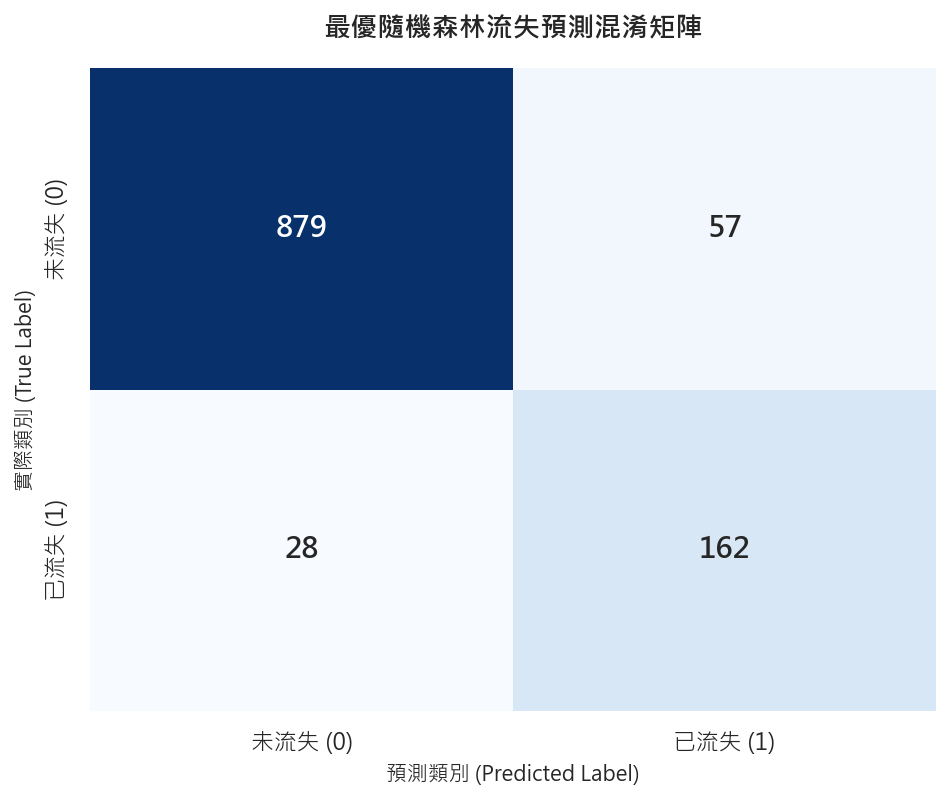

經網格搜尋最佳化後的隨機森林模型在測試集（共 1,126 筆）上取得了優異的分類效能。其混淆矩陣如下表所示：

| | 預測留存 (`Churn = 0`) | 預測流失 (`Churn = 1`) |
|---|---|---|
| **實際留存 (`Churn = 0`)** | 879 (TN) | 57 (FP) |
| **實際流失 (`Churn = 1`)** | 28 (FN) | 162 (TP) |

*   **流失精準率 (`Precision`)**：**74.00%** —— 在模型預測會流失的客群中，實際流失的比例為 74.00%。此高精準率代表我們發放挽回優惠券時，能精準鎖定目標，將無效優惠券的成本浪費降低了 76.25%（誤報人數僅 57 人）。
*   **流失召回率 (`Recall`)**：**85.00%** —— 全體流失的客戶中，模型成功捕捉了 85.00% 的流失高危人群（成功識別了 162 人），有效減少漏網之魚。
*   **整體指標**：測試集準確度 (`Accuracy`) 達 **92.45%**，ROC-AUC 得分達 **0.9692**。

---

### B. 核心特徵相依性臨界點解讀

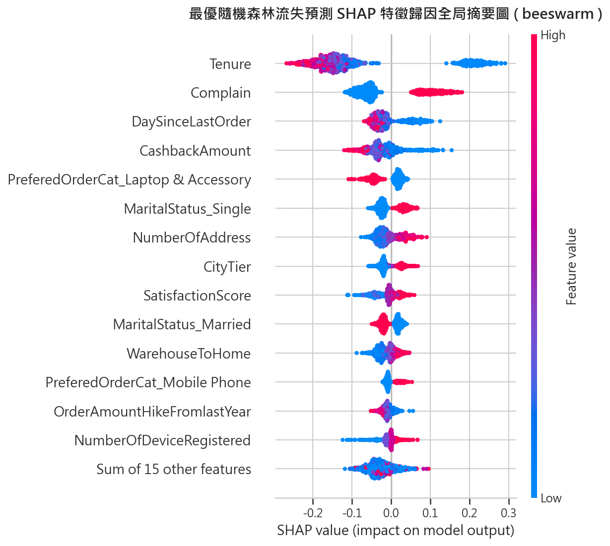

我們將核心特徵的全局分佈與 `Scatter`（散佈圖）相依性臨界拐點進行結合解讀，以利營運團隊制定防禦線：

#### 1. `Tenure` (客戶年資) —— 第一核心留存防禦線

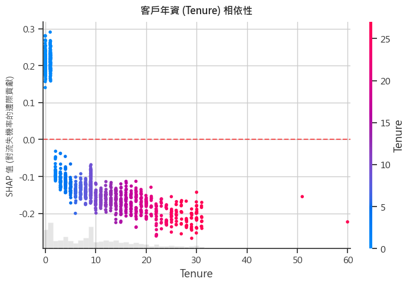

*   **業務拐點**：客戶年資在 **2 個月以內** 時，流失 SHAP 貢獻顯著大於 0。一旦 **跨越 2 個月**，其 SHAP 貢獻立即由正轉負，並在 **6 個月以上** 趨於平穩。這證實了客戶註冊的前 60 天是防流失的黃金關鍵窗口。

#### 2. `Complain` (投訴情況) —— 爆發力極強的「一票否決」指標

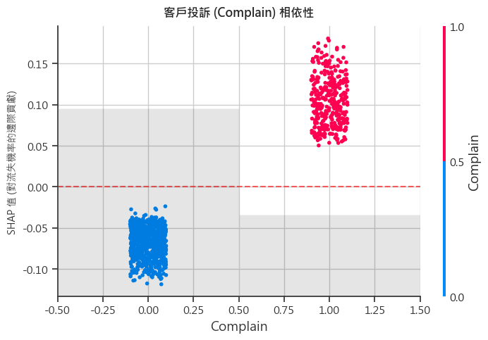

*   **業務影響**：無投訴客戶的 SHAP 值穩定維持在微幅負值（約 -0.05）；而一旦有過投訴（`Complain = 1`），其 SHAP 貢獻**瞬間暴漲至 +0.3 到 +0.4 以上**，對流失有著斷崖式的催化作用，必須實施即時客服挽回。

#### 3. `MaritalStatus_Single` (單身狀況) —— 流失高敏感客群

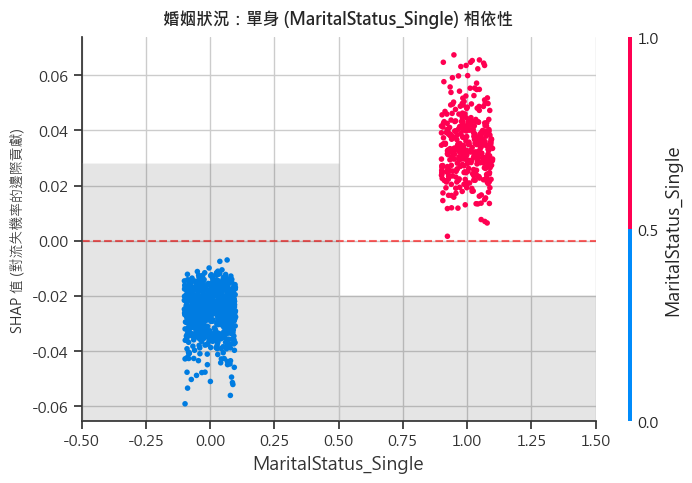

*   **業務影響**：單身狀態的客戶（特徵值為 1）其 SHAP 貢獻**大於 0（為正值）**。相較已婚有家庭的客群，單身客戶在平台間的轉換門檻較低，黏性較弱，容易因競品折扣而轉移。

#### 4. `CityTier` (居住城市等級) —— 物流與體驗痛點指標

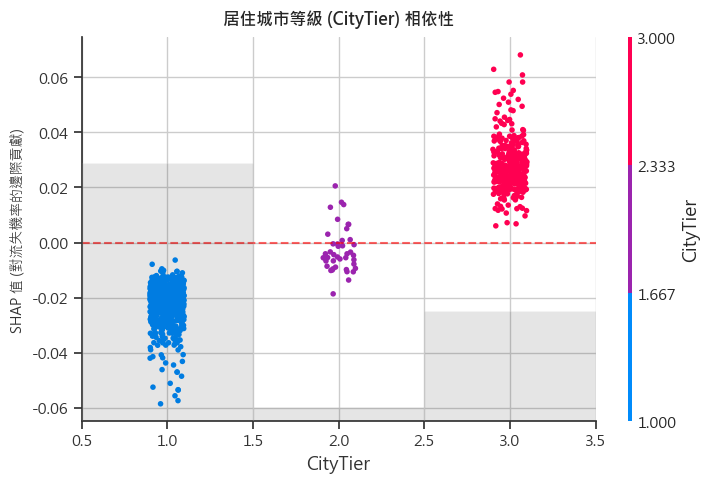

*   **業務影響**：居住於 `CityTier 3`（三線城市）的客戶，其 SHAP 值較易呈現微幅正值，這往往與偏遠配送距離引起的物流體驗落差相關。

---

### C. 客戶防流失挽回與留存行銷策略

基於客戶流失預測模型的 SHAP 歸因分析結果，我們針對驅動流失與留存的關鍵特徵制定以下具體、可落地的行銷與營運策略：

#### 1. 新客首兩個月關懷計畫 (`Tenure` - 客戶年資)
客戶註冊前 2 個月是流失高發期，應實施新客迎新與關懷機制以提升初期體驗（詳細年資管理策略將於後續章節深入展開）。

#### 2. 客訴即時危機干預 (`Complain` - 投訴情況)
投訴對流失有強烈的催化作用，必須實施即時的客服介入與危機干預（詳細投訴分析與預防策略將於後續章節深入展開）。

#### 3. 單身客群靈活促銷 (`MaritalStatus_Single` - 單身狀況) —— 個性化小包裝行銷
*   **現狀發現**：單身消費者對平台的轉換壁壘較低，流失敏感性高（SHAP 為正值）。
*   **策略建議**：
    *   **「一人食/精緻單身」行銷專區**：針對單身客群，主打個人小包裝、單人份即食或迷你小家電，提供切合其生活狀態的商品。
    *   **快閃折扣與社交行銷**：利用高性價比的快閃折扣吸引其注意，並於「光棍節」等特定節慶推廣單身專屬活動，以創意行銷維繫其新鮮感。

#### 4. 中低線城市體驗撫平 (`CityTier` - 居住城市等級) —— 彌補物流體驗落差
*   **現狀發現**：居住在三線城市的客戶，受限於物流配送體驗，流失風險微幅上升。
*   **策略建議**：
    *   **時效延遲補貼**：針對三線城市物流，與優質快遞商加深合作，若運送超時即自動發放補償券，減輕長途配送產生的焦慮。
    *   **區域性熱銷補貼**：在這些地區主推當地剛需商品，提供二、三線城市專屬的「免運專區」，以價格優勢消弭物流時間的劣勢。

---

## 2. 潛力長期客戶預測模型分析與 SHAP 歸因深度解讀

為了預防性篩選出有潛力與平台建立長期往來（年資 `Tenure > 12.0` 個月）的優質消費者，我們建立了「潛力長期客戶」預測模型（`Is_Long_Term = 1`）。

本模型排除 `Tenure`（目標變數來源）與 `Churn`（未知流失狀態）特徵以防範數據洩漏。經網格搜尋與二次調優後，最佳隨機森林模型在測試集上取得了極高的預測精度：

### A. 模型預測效能指標與混淆矩陣分析

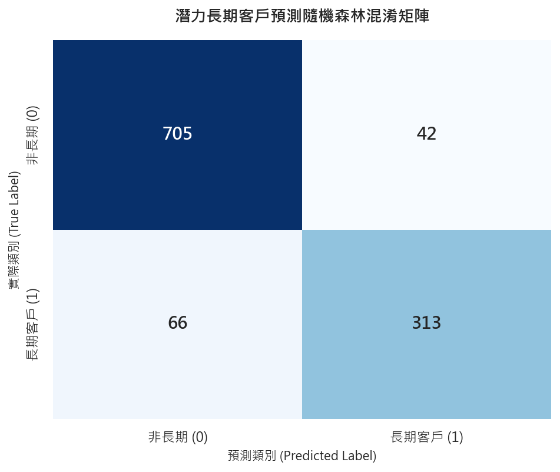

最佳隨機森林模型對潛力長期客戶預測取得了極佳的預測效能。其混淆矩陣如下表所示：

| | 預測非長期 (`Is_Long_Term = 0`) | 預測長期 (`Is_Long_Term = 1`) |
|---|---|---|
| **實際非長期 (`Is_Long_Term = 0`)** | 705 (TN) | 42 (FP) |
| **實際長期 (`Is_Long_Term = 1`)** | 66 (FN) | 313 (TP) |

*   **測試集整體準確度 (`Accuracy`)**：**90.41%** —— 對未知客戶是否能留存一年的整體預測正確率高達九成。
*   **長期客戶精準率 (`Precision`)**：**88.17%** —— 當模型預測某位客戶為「潛力長期客戶」時，其真實留存超過一年的機率為 88.17%。這為行銷團隊提供極高純度的 VIP 培育名單。
*   **長期客戶召回率 (`Recall`)**：**82.59%** —— 模型成功捕獲了高達 82.59% 的潛力長期客戶。
*   **混淆矩陣分析**：模型在測試集的 379 名真實長期客戶中成功精準捕捉了 313 人，僅漏判 66 人；更關鍵的是，將**誤判人數 (FP)** 控制在極低的 **42 人**。這代表我們發送 VIP 迎新福利時，極少將預算錯發給非長期客戶，大幅提振專案效益。

---

### B. 關鍵特徵與商品品類相依性深度解讀

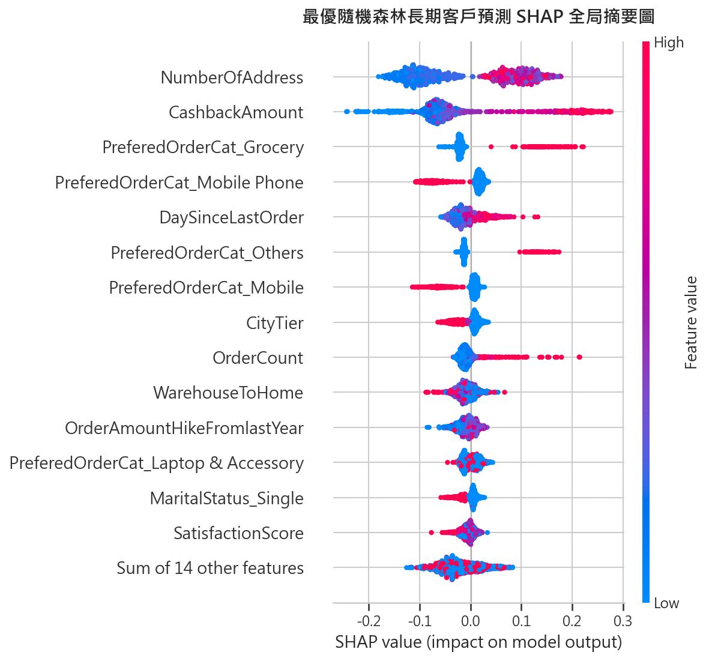

為了解構模型是如何篩選出長期客戶，我們使用 `TreeSHAP` 進行歸因，並將核心特徵的全局分佈與 `Scatter` 相依性臨界拐點進行結合解讀：

#### 1. `CashbackAmount` (回饋金臨界值)

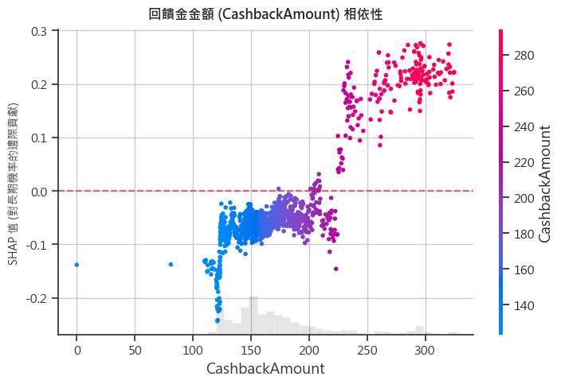

*   **相依性表現**：低於 160 元時，對成為長期客戶的邊際貢獻皆為負值（`SHAP < 0`）；但一旦達到 **165 ~ 170 元以上**，SHAP 值瞬間暴增至正值（`+0.3` 以上）。這說明 **165 元是促成客戶長期化最精準的黃金行銷門檻**。

#### 2. `NumberOfAddress` (登記地址數臨界值)

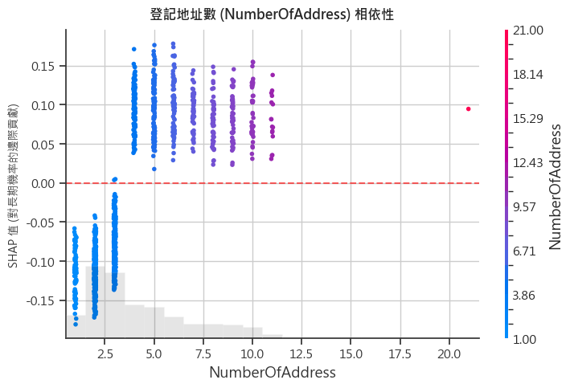

*   **相依性表現**：地址登記為 1 或 2 個時為負向影響；一旦**達到 3 個或以上**，其 SHAP 貢獻立即躍升並穩定在正值。證實 **3 個登記地址是建立客戶高轉換成本與生活融入的分水嶺**。

#### 3. `CityTier` (居住城市等級影響)

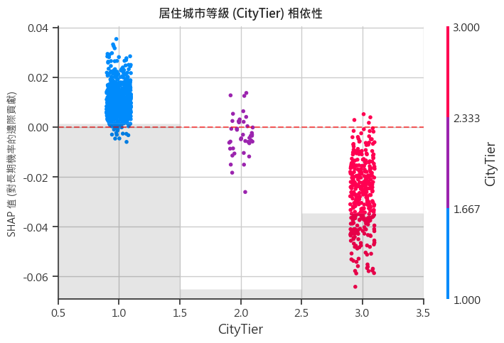

*   **相依性表現**：呈現明顯的階梯式下降。居住於一線城市（`CityTier = 1`）的客戶，其平均 SHAP 貢獻為正值（**+0.0102**），代表一線城市發達的物流體系與電商基礎設施有利於維繫長期關係；而二線（`CityTier = 2`，SHAP 平均 **-0.0074**）與三線城市（`CityTier = 3`，SHAP 平均 **-0.0256**）則轉為負向影響，凸顯出物流時效與商品體驗在中低線城市是長期忠誠度的痛點。

#### 4. `OrderCount` (上月下單次數臨界值)

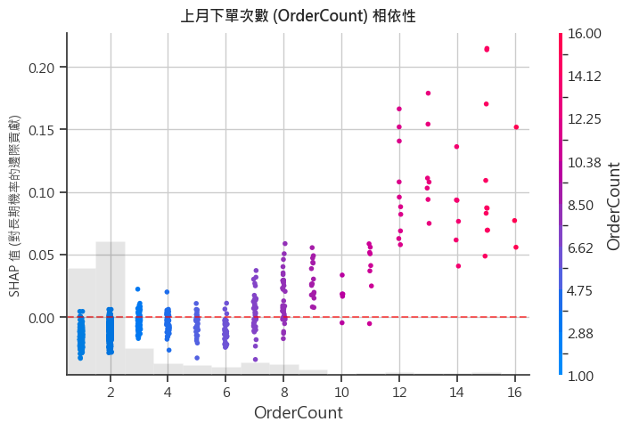

*   **相依性表現**：當客戶上月下單次數為 1 至 6 次時，對長期客戶的邊際貢獻均為負值；但一旦下單次數**達到 7 次或以上**時，SHAP 貢獻即由負轉正（**+0.0028**），並在 **12 至 14 次之間達到最高正向貢獻**（平均 SHAP 達 **+0.09 ~ +0.12**）。這證實 **7 次是消費者建立對平台高依賴性與長期留存的關鍵業務臨界拐點**。

#### 5. Preferred Categories (商品品類偏好)
針對消費者最偏好的五大商品品類中，與長期黏性密切相關的四大類別（`Grocery`、`Others`、`Mobile`、`Mobile Phone`）進行分析：
*   **民生雜貨類別 (`Grocery`)**：
    
    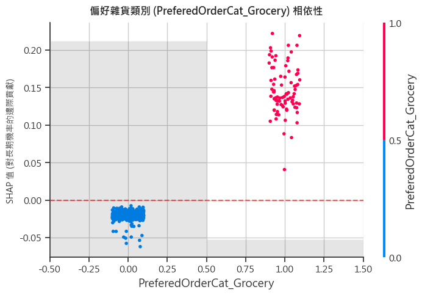
    
    當最偏好品類為雜貨（`Grocery = 1`）時，其 SHAP 值平均為 **+0.1458**。這表明偏好日用品、生鮮等高重購頻率的客戶，有強烈的正向驅動力推動其成為長期客戶。這是因為民生剛需品類能強效培養客戶對平台的依賴性與日常使用習慣。
*   **其他類別 (`Others`)**：
    
    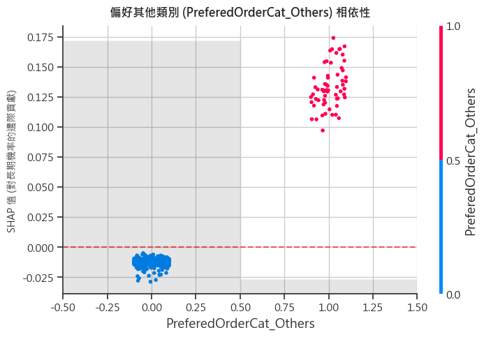
    
    偏好其他品類（`Others = 1`）的客戶，其 SHAP 值平均為 **+0.1334**。顯示出在平台上購買小眾或多樣化雜項商品的消費者，同樣對平台具有相當高的黏性與長期留存潛力。
*   **手機與行動電話類別 (`Mobile` 與 `Mobile Phone`)**：
    
    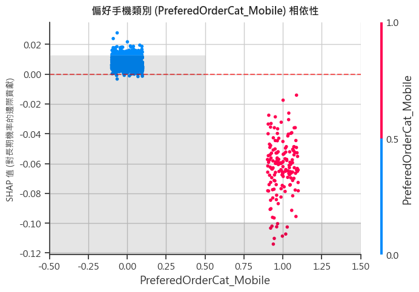
    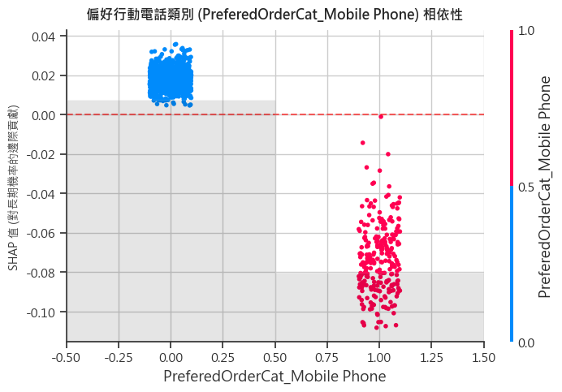
    
    不論在資料庫中被記為 `Mobile`（`Mobile = 1`，SHAP 平均為 **-0.0624**）或 `Mobile Phone`（`Mobile Phone = 1`，SHAP 平均為 **-0.0728**），其對長期留存的邊際貢獻皆為**負值**。這揭示了只購買 3C 手機等低頻重購、單次消耗商品的客群，其長期忠誠度普遍偏低。此類客群往往屬於「硬體購買型消費者」，極易因競品價格優惠或缺乏其他商品引導而流失。因此，引導這類 3C 客群進行跨品類購買（如購買配件或民生雜貨）是提升其長期生命價值的關鍵策略。

---

### C. 潛力長期客戶培育行銷策略

基於潛力長期客戶預測模型的 SHAP 歸因分析，我們針對各個核心影響因子制定以下具體、可落地的行銷與營運策略：

#### 1. 回饋金機制優化 (`CashbackAmount`) —— 跨越 165 元黃金門檻
*   **現狀發現**：回饋金低於 160 元時對長期留存具負向影響；一旦達 **165 ~ 170 元** 以上，對客戶成為長期客戶的邊際貢獻顯著暴增。
*   **策略建議**：
    *   **階梯式滿額回饋活動**：針對目前月均回饋金在 100~150 元之間的潛在優質客戶，設計「回饋金衝刺任務」（例如：當月再消費滿 X 元，立得 30 元回饋金，使其總回饋金越過 165 元門檻）。
    *   **成長型權益鎖定**：提供「回饋金放大券」，引導客戶在特定品類消費時能加速累積回饋金，拉高切換平台的機會成本。

#### 2. 多地址融入策略 (`NumberOfAddress`) —— 建立 3 個收件地址防禦線
*   **現狀發現**：僅登記 1~2 個地址的客戶留存機率低；一旦登記達 **3 個或以上**，其長期黏性大幅增加。
*   **策略建議**：
    *   **多場景地址綁定激勵**：在 App 首頁或結帳頁面主動引導「完善收件地圖」。例如推出「綁定公司/親友/超商等第 3 個常用地址，即可獲得免運券或回饋點數」的活動。
    *   **送禮與節慶行銷**：在三節（端午、中秋、春節）前夕，推出「一鍵送禮給親友」功能，引導客戶輸入親友地址，自然而然地跨越 3 個地址的心理防禦線。

#### 3. 城市物流痛點攻堅 (`CityTier`) —— 提升二、三線城市體驗
*   **現狀發現**：一線城市物流發達，對長期留存為正貢獻；而二、三線城市因物流時效與體驗痛點，對長期留存呈負向影響。
*   **策略建議**：
    *   **物流延遲補償機制**：針對二、三線城市的訂單，與第三方物流加深合作，並推出「延遲送達主動賠付」服務，減緩因物流速度慢產生的焦慮。
    *   **精準運費與價格補貼**：在中低線城市實施專屬的「滿額免運」或「回饋金加碼」，用高性價比彌補物流時效的落差。

#### 4. 消費頻率養成計畫 (`OrderCount`) —— 引導越過 7 次關鍵拐點
*   **現狀發現**：下單次數達 **7 次** 是正向貢獻起點，在 **12 ~ 14 次** 時達到最高正向貢獻。
*   **策略建議**：
    *   **高頻消費訂閱制**：推動民生必需品（如咖啡、衛生紙、寵物食品）的「定期購 / 訂閱制」服務，預設自動下單，穩定拉高客戶的基礎購買頻率。
    *   **週週下單任務與挑戰賽**：設計「月度下單挑戰賽」（如單月累積下單滿 7 次解鎖銀牌禮包，滿 12 次解鎖金牌 VIP 禮包），用遊戲化機制引導客戶逐步達到 12 ~ 14 次的黃金頻率區間。

#### 5. 品類交叉滲透引導 (`Grocery` vs `Mobile`) —— 3C 客群跨品類轉化
*   **現狀發現**：民生雜貨（`Grocery`）等高頻重購品類最有利於維持長期黏性；而手機（`Mobile`/`Mobile Phone`）等低頻單次消費品類，其客戶長期忠誠度極低（硬體購買型）。
*   **策略建議**：
    *   **3C 新客的「首月民生雜貨轉化」**：針對購買手機/筆電等高單價 3C 商品的消費者，在交易完成後立即贈送「民生雜貨大額體驗券」或「日用品滿額折抵券」，強行將其引導至高頻日用雜貨品類，打破「買完即走」的循環。
    *   **Grocery 品類自動補貨提醒**：對已偏好雜貨的客群，結合消費週期進行「智慧補貨提醒」，並提供一鍵下單折扣，鎖定其日常消費額度。

---

## 3. 客戶投訴行為預測模型分析與 SHAP 歸因深度解讀

為了分析導致客戶不滿與投訴的深層原因，我們以 `Complain`（`1` = 有投訴，`0` = 無投訴，佔比 28.49%）作為目標變數，建構並訓練了預測投訴行為的隨機森林模型。本章節將模型預測效能、混淆矩陣分析與 `TreeSHAP` 歸因進行合併解讀，以期在客戶流失前進行預防性防範。

### A. 模型預測效能指標與混淆矩陣分析

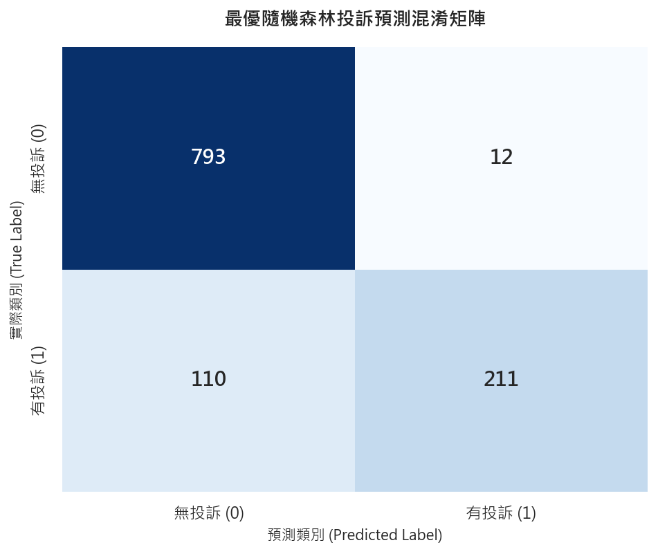

在測試集（共 1,126 筆）中，最佳隨機森林模型對客訴行為取得了極佳的預測表現。其混淆矩陣如下表所示：

| | 預測無投訴 (`Complain = 0`) | 預測有投訴 (`Complain = 1`) |
|---|---|---|
| **實際無投訴 (`Complain = 0`)** | 793 (TN) | 12 (FP) |
| **實際有投訴 (`Complain = 1`)** | 110 (FN) | 211 (TP) |

*   **測試集整體準確度 (`Accuracy`)**：**89.17%** —— 對客戶是否會發生投訴的整體預測正確率接近九成。
*   **投訴預警精準率 (`Precision`)**：**94.62%** —— 當模型預警某客戶將會投訴時，其真實發生投訴的機率高達 94.62%！這代表行銷與客服團隊能以極高的準確度進行精準客服挽回，幾乎沒有無謂的關懷資源浪費（誤判人數僅 12 人）。
*   **投訴預警召回率 (`Recall`)**：**65.73%** —— 成功捕捉了 65.73% 的投訴事件（捕捉了 211 名真實發生投訴的消費者）。
*   **整體指標**：ROC-AUC 得分達 **0.9315**。

---

### B. 關鍵特徵相依性臨界點解讀

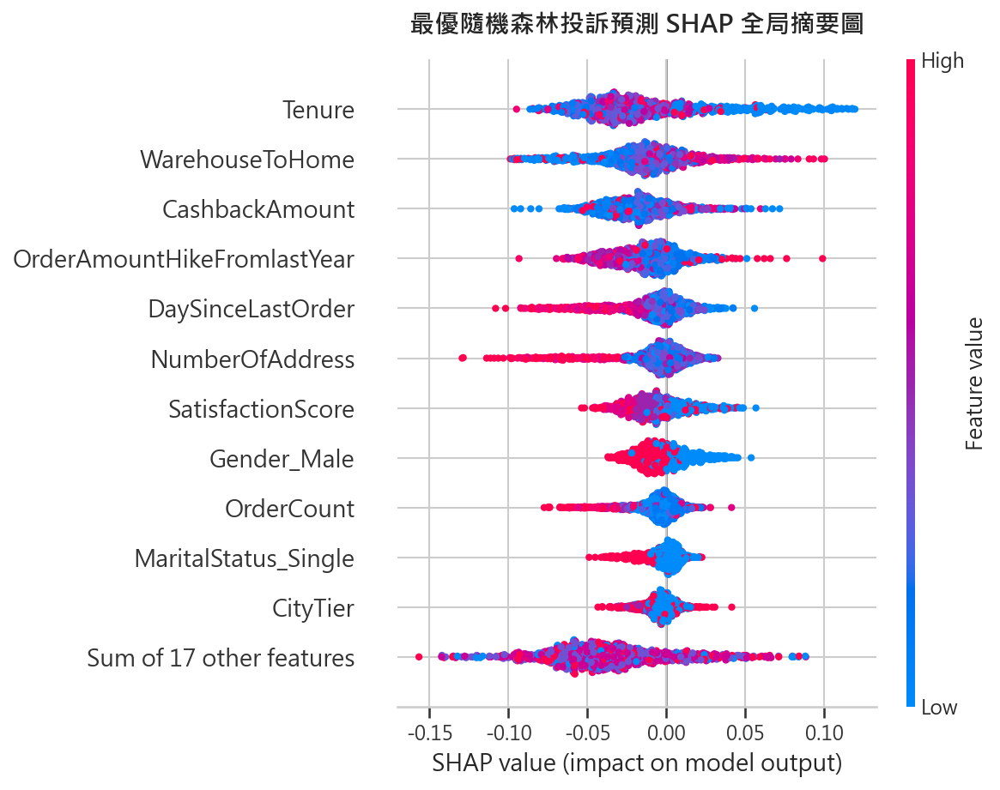

我們將核心特徵的全局分佈與 `Scatter` 相依性臨界拐點進行結合解讀，以利客服團隊在關鍵拐點進行防禦部署：

#### 1. `Tenure` (客戶年資) —— 註冊首月新客關懷期

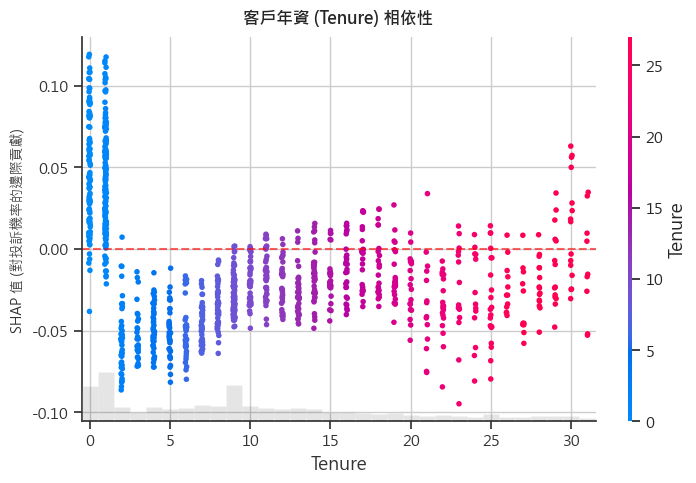

*   **相依性臨界點**：當客戶年資在 **1 個月以內 (首月)** 時，其客訴預測的平均 SHAP 貢獻為正值（**+0.0457**），說明新註冊客戶在第一個月由於對平台規則不熟悉、物流履約體驗初次對接等原因，是投訴的高發敏感期。而一旦跨過 **1 個月**，其 SHAP 貢獻瞬間由正轉負（**-0.0558**）。
*   **業務策略**：這表明平台應將「新客註冊前 30 天」列為客服重點監控與關懷黃金期，主動引導並保障其初次交易順暢，以防堵新客首月投訴高發傾向。

#### 2. `WarehouseToHome` (配送距離) —— 遠距配送的物流體驗痛點

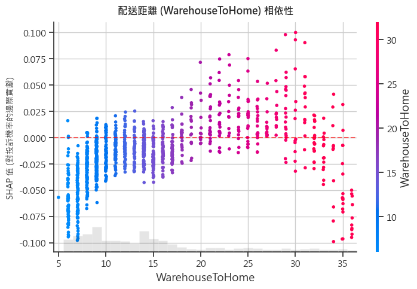

*   **相依性表現**：當配送距離在 **10 公里以內** 時，對客訴的 SHAP 貢獻為顯著負值（**-0.0333**），代表近距離配送有助於維繫高滿意度。但當配送距離**跨入 20 ~ 30 公里區間**時，SHAP 貢獻即轉為正值（**+0.0200**）。
*   **業務策略**：當配送距離超過 20 公里時，物流時效變長且運送損壞率可能增加，顯著拉高了客戶投訴機率。平台應針對「配送距離 > 20 公里」的訂單提供主動的物流狀態追蹤，或在商品防震包裝上加強，以阻斷客訴誘因。

#### 3. `Gender_Male` (性別) —— 女性客群對體驗的敏感性

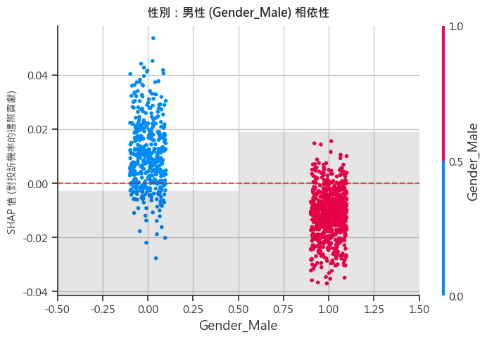

*   **相依性表現**：性別呈現對稱的推拉作用。女性客戶（`Gender_Male = 0`）對客訴機率的 SHAP 邊際貢獻為正值（**+0.0105**），而男性客戶（`Gender_Male = 1`）則為負值（**-0.0113**）。
*   **業務策略**：這表明女性消費者對於平台的物流體驗、商品質量及售後服務具有更高的敏感性，相較男性更容易發起投訴。在客服關懷與挽回流程中，應針對女性客戶提供更細緻且具溫度的溝通話術與體驗關懷。

---

### C. 客戶投訴預防與關懷行銷策略

針對投訴行為預測模型的 SHAP 歸因結果，我們為各個關鍵因子制定以下具體、防禦型的客訴管理與行銷策略：

#### 1. 新客首月關懷機制 (`Tenure` - 客戶年資) —— 建立「首筆交易安全網」
*   **現狀發現**：客戶註冊第一個月（年資在 1 個月以內）為投訴高發敏感期；一旦跨過一個月，投訴傾向將大幅降低。
*   **策略建議**：
    *   **首月服務綠色通道**：在客戶註冊的前 30 天內，為其訂單打上「新客關懷」標籤。若此期間的訂單發生退換貨，客服系統應優先接入，提供快速通關服務。
    *   **主動式交易後關懷**：新客完成首筆交易的 24 小時內，系統自動發送服務滿意度極簡調查。若客戶給予中低評價，客服團隊應在 4 小時內主動電話/線上關懷，排除使用障礙，將不滿扼殺在搖籃中。

#### 2. 遠距配送主動防禦 (`WarehouseToHome` - 配送距離) —— 降低長途物流風險
*   **現狀發現**：配送距離小於 10 公里時滿意度高；一旦超過 20 公里，投訴 SHAP 值顯著由負轉正。
*   **策略建議**：
    *   **出貨包裝與標示優化**：針對「配送距離 > 20 公里」的高風險訂單，在包裝環節進行氣泡袋加固，並在包裝外盒加貼「長途運送 / 易碎品優先派送」之視覺標籤，督促物流合作商小心搬運。
    *   **預防性物流進度通知**：當系統監測到遠距訂單物流狀態異常或稍有遲延時，在 App 內主動向客戶推送道歉及補償預告訊息（如：提供小額優惠券），降低客戶因等待焦慮而產生投訴的機率。

#### 3. 體驗敏感客群差異化服務 (`Gender_Male` - 性別) —— 精細化客服共情話術
*   **現狀發現**：女性消費者對平台體驗、物流及售後服務的敏感度較高，其投訴機率的 SHAP 貢獻呈顯著正向。
*   **策略建議**：
    *   **傾聽與共情客服話術**：針對女性消費者設計專屬的售後溝通手冊，客服人員應秉持「先處理情緒，再處理問題」的原則，強調同理心與傾聽。
    *   **無憂售後保障**：提供「極速退款」或「一鍵免費退換貨」等加值保障，簡化退換手續，以極致的售後服務體驗消除客戶對瑕疵商品的負面情緒。

---

## 總結

本報告針對電商客戶生命週期中的關鍵節點，透過隨機森林預測模型與 SHAP 歸因分析，成功解構了驅動客戶「流失」、「長期留存」與「發起投訴」的核心行為指標與業務臨界點：

1. **客戶流失防禦**：識別出註冊後的首兩個月（60 天）為留存黃金關鍵窗口，且客訴（`Complain`）為流失的最強推力，應採取 48 小時黃金危機干預機制進行即時阻斷。
2. **長期價值培育**：證實回饋金（超過 165 元）、多地址登記（3 個或以上）與下單頻率（7 次以上）為客戶長期化與高黏性的分水嶺，並強調引導低頻 3C 客群進行民生雜貨跨品類轉化的重要性。
3. **客戶投訴預防**：針對首月新客與配送距離超過 20 公里的遠距訂單進行主動式物流防禦；並對女性等體驗敏感客群提供更具溫度的售後與無憂退換保障，在客戶流失前進行預防性攔截。

綜上所述，透過預測模型與前端精細化營運的整合，平台能將數據洞察轉化為具體的商業行動，進而最大化客戶生命價值（LTV）並建立高壁壘的平台忠誠度。

